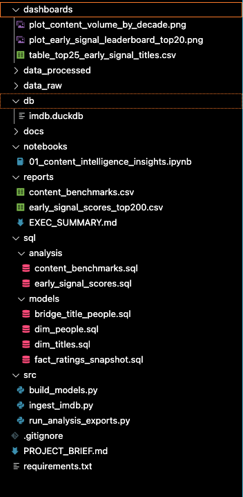
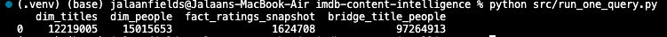
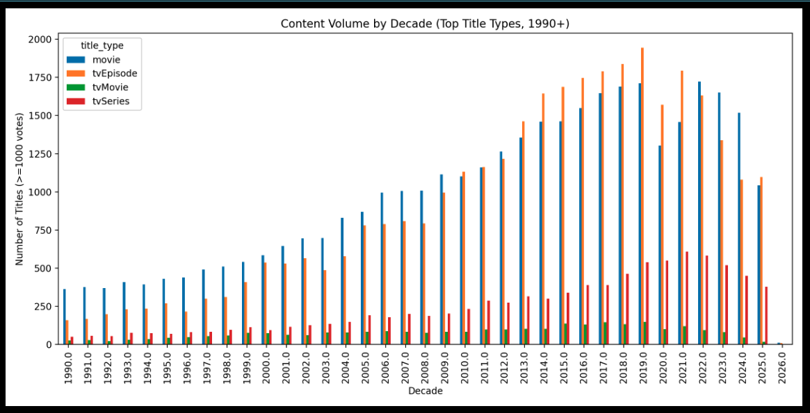
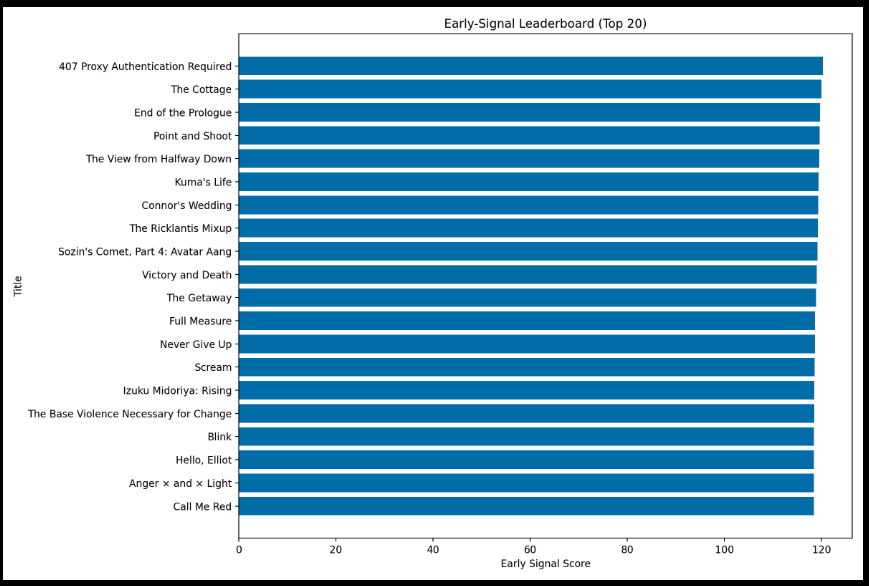

# IMDb Content Intelligence System

End-to-end analytics engineering project that transforms raw IMDb datasets into a decision-ready content intelligence system. The project benchmarks content performance across title types and decades and identifies potential breakout titles using an interpretable early-signal scoring approach.

The system mirrors how streaming platforms evaluate content portfolios, combining reproducible data pipelines, dimensional modeling, SQL-driven analysis, and Python-based insights.

---

## Project Screenshots

### 1. Repository Structure
Shows the overall organization of the analytics pipeline, including ingestion scripts, SQL models, analysis queries, notebooks, and outputs.

---

### 2. End-to-End Pipeline Execution
Demonstrates successful execution of the full pipeline:
- ingestion
- model building
- analysis exports

---

### 3. Model Health Check
Verifies that core dimensional and fact tables were created successfully in DuckDB.

---

### 4. Content Benchmarking by Decade
Benchmarks content volume across title types and decades for titles with sufficient audience engagement.

---

### 5. Early Signal Leaderboard
Ranks emerging titles using an interpretable early-signal proxy score based on ratings and vote maturity.

---

### 6. Top Picks Table
A decision-ready table highlighting the top early-signal titles, suitable for stakeholder review.

---

## Objective

The goal of this project is to build a scalable analytics system that:

1. Benchmarks historical content performance without mixing fundamentally different title types.
2. Identifies emerging titles that may represent early breakout opportunities.
3. Emphasizes reproducibility, interpretability, and decision-oriented analytics design.

---

## Data Sources

IMDb datasets used in this project:
- `title.basics` — title attributes (type, primary title, year, genres)
- `title.ratings` — average rating and vote count
- `title.principals` — relationships between titles and people
- `name.basics` — people metadata

Raw data files are stored locally in `data_raw/` and are excluded from version control.

---

## Architecture Overview

